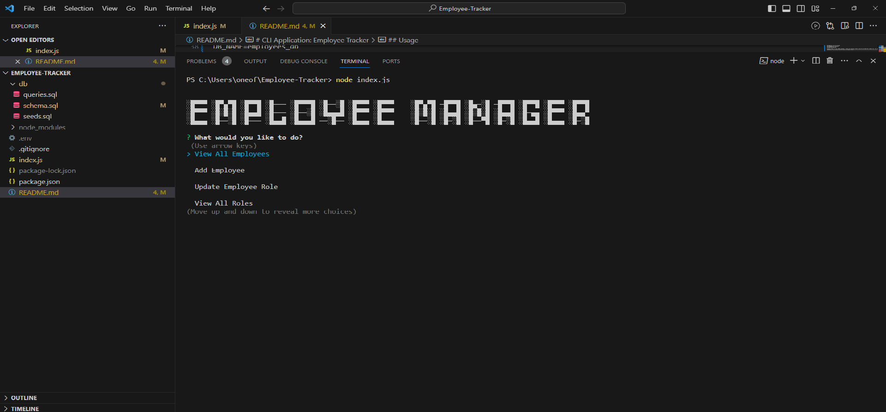
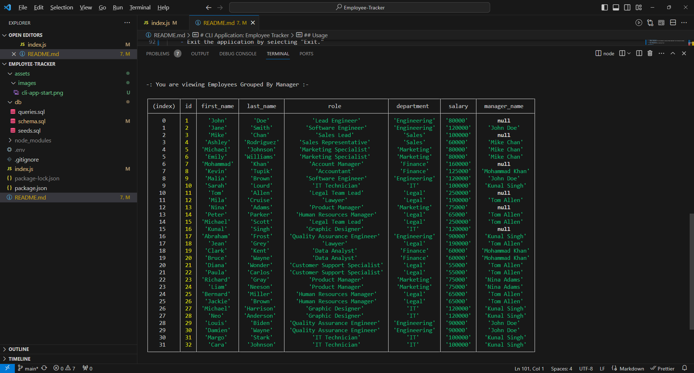
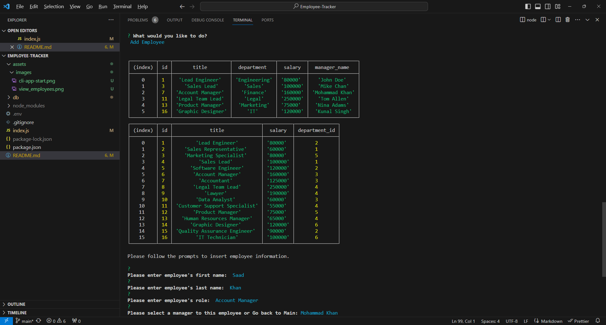
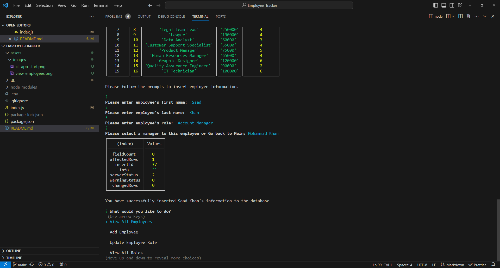
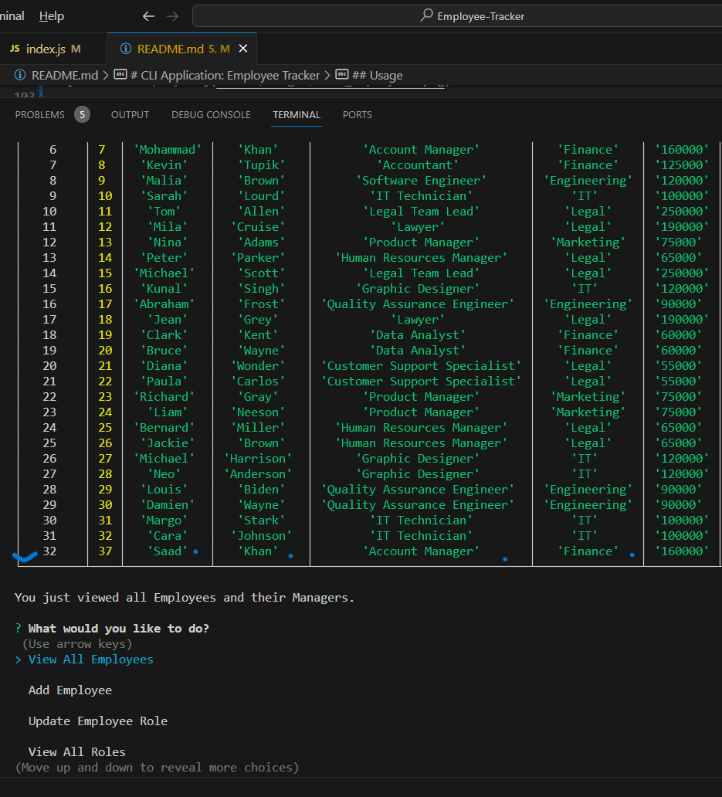
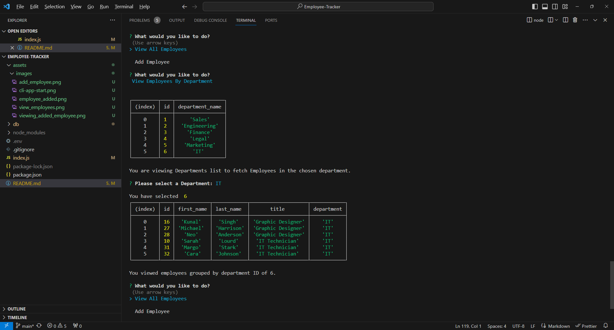
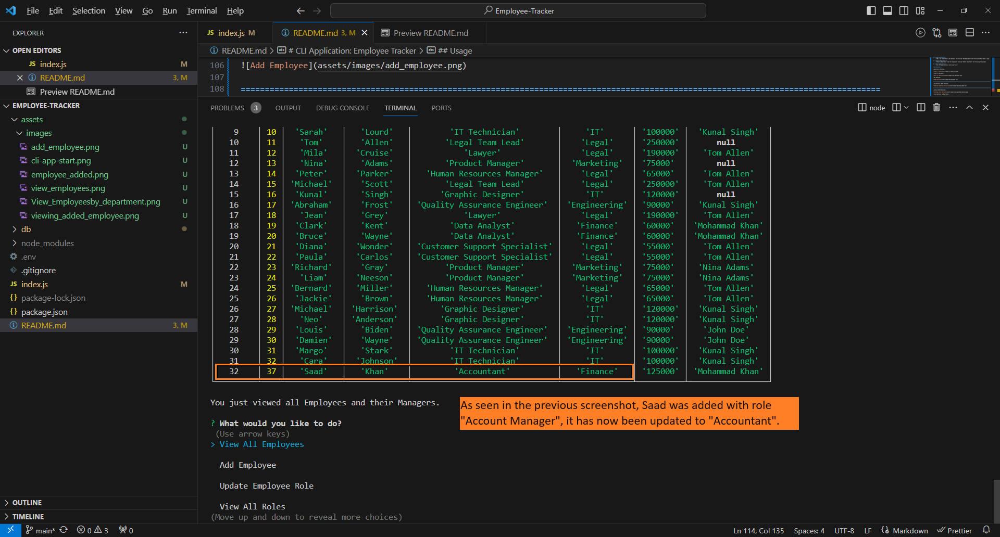

# CLI Application: Employee Tracker

## Table of Contents

- [Description](#description)
- [Installation](#installation)
- [Usage](#usage)
- [Credits](#credits)
- [License](#license)

## Description

The CLI application is a user-friendly interface created for small business owners to manage the employee information in a database. It will enable users to perform various tasks related to employees, roles, and departments, such as viewing, adding, updating, or deleting records. The purpose is to make it easier to efficiently organize and maintain employee data. Through this project, I have learned valuable skills in building a command-line interface (CLI) application and working with SQL databases. I learned to write a few SQL queries to interact with the employees database, practiced handling user input using inquirer, and displaying results in a user-friendly format.

[Walkthrough of CLI application](https://watch.screencastify.com/v/JouKMIA1CP5jkP9C5Oyh)

## Installation

To install and set up the project, follow these steps:

Clone the Repository:

Clone the project's repository from GitHub to your local machine using the following command:

git clone [Employee-Tracker](https://github.com/hafsah1976/Employee-Tracker)

Install Node.js: Ensure you have Node.js version 16 installed on your computer. You can download and install it from the official Node.js website.

Install Dependencies: Navigate to the project directory in your terminal and run the following command to install the required Node.js packages:

npm install

Configure the Database: Set up a MySQL database for the project. Create a .env file in the project root directory and add your database configuration (host, user, password, and database name) as environment variables.

For example:

DB_HOST=localhost
DB_USER=your_my_sql_username
DB_PASSWORD=your_password
DB_NAME=employees_db

Database Setup: In your MySQL database, create the necessary tables using the provided SQL schema file. You can import it using a tool like phpMyAdmin or by running the SQL script in a MySQL client:

mysql -u your_user -p --> enter your password --> run the command "source schema.sql;" then run the command "source seeds.sql;"

Start the Application: Once the database is set up and the dependencies are installed, you can start the CLI application with the following command:

node index.js

The application will provide on-screen instructions and a menu to interact with the database. Follow the prompts to perform various operations.

## Usage

1. **View All Employees:**
   - Select "View All Employees" from the main menu to see a list of all employees, their roles, departments, salaries, and managers.

2. **View Employees by Department:**
   - Choose "View Employees by Department" to see a list of employees grouped by department.

3. **Add Employee:**
   - To add a new employee, choose "Add Employee" and follow the prompts to enter their information, including first name, last name, role, and manager.

4. **Update Employee Role:**
   - Update an employee's role by selecting "Update Employee Role" and following the prompts.

5. **Delete a Record:**
   - Remove an employee, role, or department from the database by choosing "Delete a Record" and following the prompts.

6. **View All Roles:**
   - View a list of all available roles by selecting "View All Roles."

7. **Add Role:**
   - Add a new role to the database by choosing "Add Role" and following the prompts to enter the role's title, salary, and department.

8. **Add Department:**
    - Add a new department to the database by selecting "Add Department" and entering the department's name.

9. **View Employees Count**
    - View current count of employees in your organization.

10. **Exit Application:**
    - Exit the application by selecting "Exit."

**Screenshots:**

_Application Startup:_

_View All Employees:_

_Add Employee:_

=====================================================================================================================================

_Successfully Added Employee:_

======================================================================================================================================

_Viewing Added Employee:_

_View Employees by Department:_

_Update Employee Role:_

_Remove Employee:_

## Credits

**Package Name:** mysql2
**Source:** [npmjs.com/package/mysql2](https://www.npmjs.com/package/mysql2)

[Class Activities on GitLab authored by Louis Delia and Marcos Mujica](https://git.bootcampcontent.com/George-Washington-University/GWU-VIRT-FSF-PT-05-2023-U-LOLC/-/tree/main/12-SQL)

[Interactive Command Line Prompts](https://www.digitalocean.com/community/tutorials/nodejs-interactive-command-line-prompts)

## License

Copyright (c) 2023 hafsah1976

Permission is hereby granted, free of charge, to any person obtaining a copy
of this software and associated documentation files (the "Software"), to deal
in the Software without restriction, including without limitation the rights
to use, copy, modify, merge, publish, distribute, sublicense, and/or sell
copies of the Software, and to permit persons to whom the Software is
furnished to do so, subject to the following conditions:

The above copyright notice and this permission notice shall be included in all
copies or substantial portions of the Software.

THE SOFTWARE IS PROVIDED "AS IS", WITHOUT WARRANTY OF ANY KIND, EXPRESS OR
IMPLIED, INCLUDING BUT NOT LIMITED TO THE WARRANTIES OF MERCHANTABILITY,
FITNESS FOR A PARTICULAR PURPOSE AND NONINFRINGEMENT. IN NO EVENT SHALL THE
AUTHORS OR COPYRIGHT HOLDERS BE LIABLE FOR ANY CLAIM, DAMAGES OR OTHER
LIABILITY, WHETHER IN AN ACTION OF CONTRACT, TORT OR OTHERWISE, ARISING FROM,
OUT OF OR IN CONNECTION WITH THE SOFTWARE OR THE USE OR OTHER DEALINGS IN THE
SOFTWARE.
